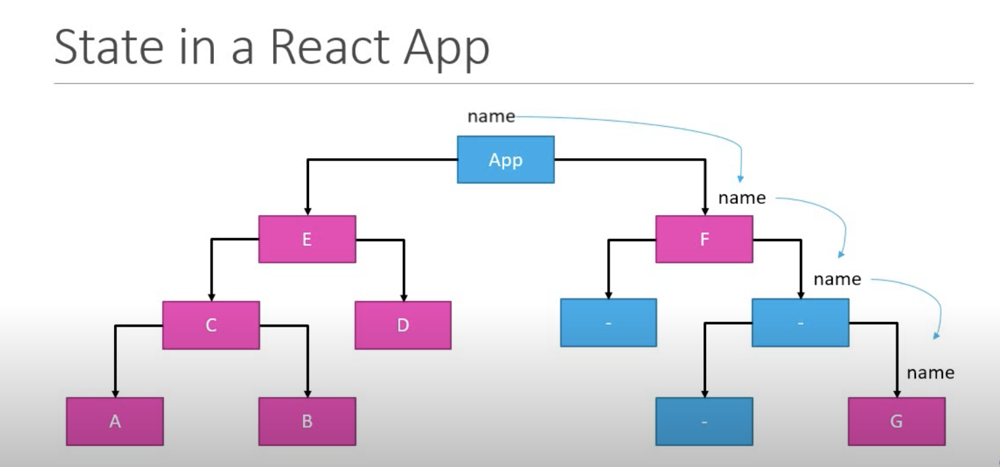
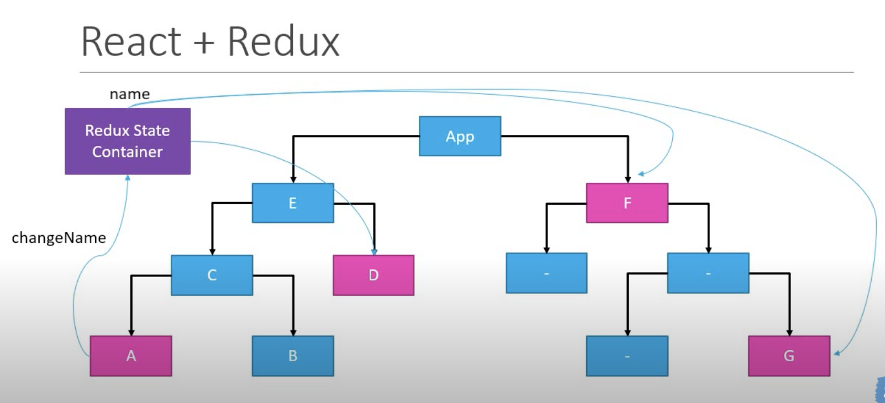

# what is redux?

- Official definition : redux is predictable state container for javaScript apps.

### explanation :

1. Redux is for javascript application.
   - it's not tied to react and can be used with react, angular, vue or even vanilla javascript.
2. Redux is a state container.
   - it stored a state of your application.
3. Redux is predictable.
   - change in state is predictable.

## why redux?

- Sometime we need to pass the state from 1 component to another component we can achieve this by passing the state as props.
- but if component is nested deep inside then we have unnecessarily pass the state throughout the component tree.
- also we may to to lift the state in some scenario, eg in below component tree, if we need to pass the state from component-A to component-G then 1st we have lift the state till App-component then again we have to pass the state to component-G down the component tree.

- how lifting the state looks like :
  
- how can we achieve the same requirement without lifting the state with redux:
  

## how to use redux in react?

- with the help of lib react-redux

```zsh
npm i redux
npm i react-redux
```

## do we really need redux?

- NO, now a days we have react hooks "useContext" + "useReducer" to solve state management issue. but to work in older react apps redux is required.
- and also if your project is larger then redux with redux-devtool is best way for development, debugging and testing.
