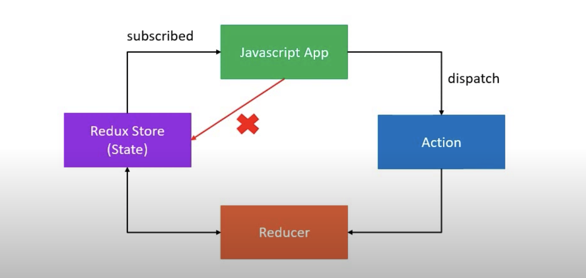

# Three Principles of redux



## First Principle : The state of your whole application is stored in an object tree within a single store

- Maintain our application state in a single object which would be managed by the Redux store
- In Cake Shop example:
  Let's assume we are tracking the number of cakes on the shelf, so state should look like

```js
shelf = {
  numberOfCakes: 10;
}
```

## 2. Second Principle : The only way to change the state is to emit(dispatch) an action, an object describing what happened

- To update the state of your app, you need to let Redux know about that with an action.
  So we are not allowed to directly update the state object.
- In Cake Shop example:
  Let the shopkeeper know what you want, means about your type of action i.e "BUY_CAKE", so action should look like

```js
{
  type: BUY_CAKE;
}
```

## 3. Third Principle :To specify how the state tree is transformed by actions, you write pure reducers

- How Reducer works : (previousState, action) => newState
- In Cake Shop example: Reducer is the shopkeeper

```js
const reducer = (state, action) => {
  switch (action.type) {
    case BUY_CAKE:
      return {
        numOfCakes: state.numOfCakes - 1,
      };
  }
};
```
