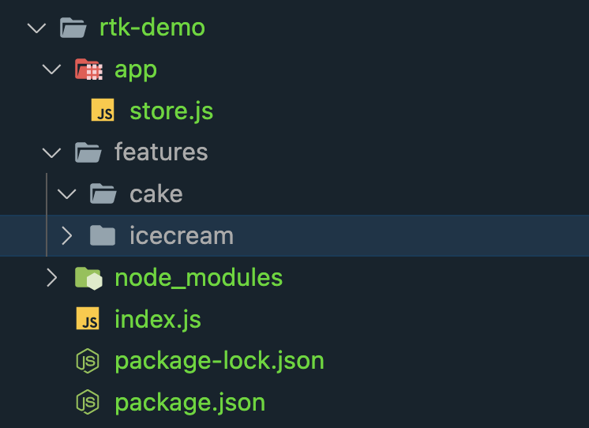

## Project Setup

1. create folder(say rtk-demo) and initialize the node project there

```zsh
mkdir rtk-demo
cd rtk-demo
npm init -y
```

2. install redux-toolkit

```zsh
npm i @reduxjs/toolkit
```

3. follow the project structure as instructed by redux-toolkit

- As per our requirement : We want to design cake and icecream shop app, so need to follow below folder structure

```
/app
    store.js     --> (this file will contain code related to redux store)
/features
    /cake
    /icecream
```



- with redux-tool kit recommendation is to group together reducer logic and actions for single feature in single file and this file name should contain 'slice' as suffices

## for cake feature

- it return the action-creators (called **actions** with the same name with which we have created the reducer)
- it also returns and main reducer function (called **reducers**)

### exporting conventions :

- export reducer as default-export
- export action-creators as named-export
