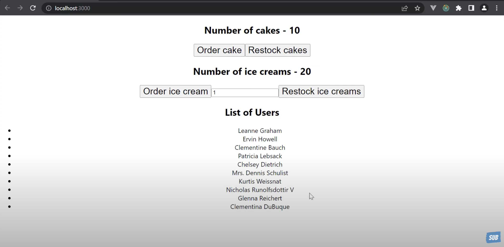

# Scenario :

- we want to build the cake and icecream shop app
- and make api call to get the list of users
  

## project setup

1. create react app rtk-react-demo

```zsh
npx create-react-app rtk-react-demo
```

2. install dependencies

```zsh
npm i react-redux @reduxjs/toolkit
npm i axios
```

3. To use redux-toolkit in react JS app every steps will be same as vanilla JS app and additionally we have to add **Provider** store to index.js file of react app.

- path : project/src/index.js

```js
import {Provider} from "react-redux";
import store from "./app/store";

<Provider store={store}>
  <App />
</Provider>;
```

- finally index.js will look like

```js
import React from "react";
import ReactDOM from "react-dom/client";
import "./index.css";
import App from "./App";
import reportWebVitals from "./reportWebVitals";
import {Provider} from "react-redux";
import store from "./app/store";

const root = ReactDOM.createRoot(document.getElementById("root"));
root.render(
  <React.StrictMode>
    <Provider store={store}>
      <App />
    </Provider>
  </React.StrictMode>
);
```
